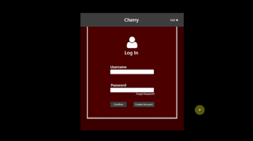
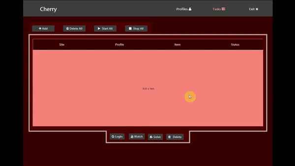
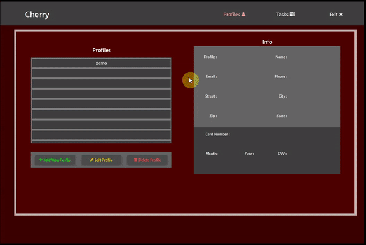
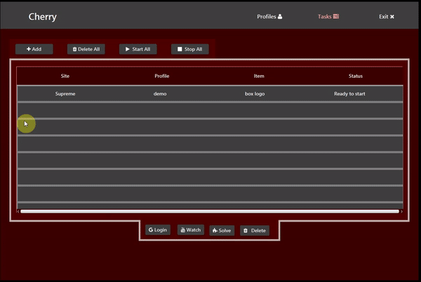
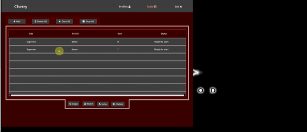

# Cherry Bot
Desktop application programmed in Java for buying items on Supreme New York website.

## Introduction
* Supreme New York is an extremely popular worldwide brand and every Thursday at 11am they refresh their webshop with the latest items. Often times the most "hyped" items sellout within a few seconds, making it very hard for people to buy those items. This bot automates the entire buying process allowing its users to check out their requested items within a few seconds giving them a better chance at scoring the items they want. 
* It sends get/post requests directly to Supreme web endpoints which is much faster than navigating the website manually.

## Features
* Supports user account creation and multiple payment profiles. All sensitive user information is securely stored in the cloud (AWS Dynamo DB) with end-to-end encryption methods.
* Multi-threading capabilities: allows users to run multiple tasks on multiple items with their choice of payment profile for each task.
* Users solve captchas during checkout.
* Gmail sign in and youtube watching for better chance at 1 click captchas. 

## To Do
* Proxy support
* Pooky handling
* "Safe" mode that uses catcha solving services to solve captchas. (More reliable for less hyped items).

## Check it out!
### First you wanna create an account

### Next, add a payment profile (easy to add, edit, and delete)

### Once you have some payment profiles set up, you can add tasks

### Optionally for each task you can login to gmail and watch youtube videos to increase your chances of a 1-click captcha at check out

### And of course this can be done with multiple tasks at a time

##Live drop demo coming soon

